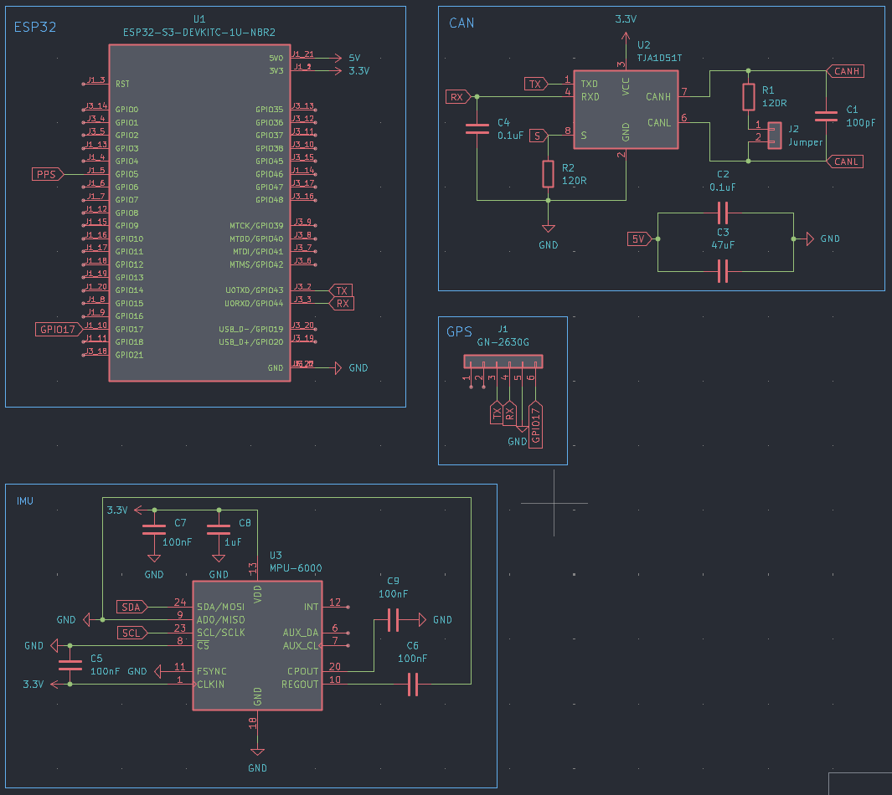

# Proyecto PCB para Moto Eléctrica de Competición

Este repositorio documenta el diseño y desarrollo de una PCB para una moto eléctrica de competición. El objetivo principal es crear una placa personalizada basada en la ESP32-S3-DevKitC-1 que integre varios sensores y módulos esenciales para la recolección de datos, comunicación y navegación del vehículo.

---

## 📈 Estado actual del proyecto

---

## 🪤 Módulos incluidos en el diseño

### ESP32-S3-DevKitC-1
Microcontrolador principal encargado de recopilar datos de los sensores, procesarlos y transmitir información vía CAN o WiFi/Bluetooth. Este microcontrolador se elige por su versatilidad, potencia y conectividad.

### CAN (Controller Area Network)
Permite la comunicación robusta y rápida entre la ESP32 y otros controladores del sistema, como el BMS (Battery Management System) o la ECU (Electronic Control Unit). Se utiliza el transceptor TJA1051T para traducir las señales lógicas de la ESP32 al bus CAN.

### IMU (Unidad de Medición Inercial)
Usando el módulo MPU-6000, permite conocer la aceleración y rotación de la moto en tiempo real. Es fundamental para la telemetría y el análisis de dinámica del vehículo.

### GPS
El módulo GN-2630G proporciona la localización de la moto mediante señal satelital. Este dato es crucial para conocer la trayectoria y velocidad en pista.

### ENV (Sensor ambiental) *(Añadir cuando se incluya)*
Este módulo recogerá datos como temperatura, presión y humedad, los cuales podrían ser útiles para ajustar el rendimiento de la moto o estudiar las condiciones en pista.

---

## 📝 Diseño de la PCB

El diseño de la PCB ha sido elaborado buscando:
- **Minimizar interferencias** entre módulos sensibles como el GPS o la IMU.
- **Facilitar el ruteado** de las pistas, manteniendo las pistas de alimentación más anchas y las de señal bien definidas.
- **Disposición funcional** de los componentes, agrupando por función: comunicación, sensores, alimentación.
- **Posibilidad de depuración** y pruebas: se dejan pines de testeo accesibles.

Los principios seguidos incluyen buenas prácticas de colocación de condensadores de desacoplo, rutas cortas para señales críticas, y separación adecuada entre señales analógicas y digitales.

---

## ⚖️ Uso de KiCad

Para el diseño del proyecto se ha utilizado **KiCad**, una suite libre de diseño de PCB.

### Metodología de trabajo:
1. **Esquemático:** Creación del diagrama esquemático conectando todos los componentes.
2. **Asignación de huellas (footprints):** Asociación de cada componente con su huella física.
3. **Diseño de la PCB:** Colocación y ruteado de las pistas.
4. **Verificación DRC/ERC:** Comprobaciones de reglas eléctricas y de diseño.
5. **Exportación de archivos Gerber:** Preparación para fabricación.
6. **Renderizado 3D:** Visualización realista de la placa antes de su fabricación.

### Plugins útile:
- **KiCad-Diff:** Para ver cambios entre commits.
- **Interactive HTML BOM:** Genera una lista de materiales navegable visualmente.
- **SnapEDA / SamacSys Plugin:** Importación directa de modelos de componentes.

---

## 🚚 Fabricación de PCBs

Para la fabricación se recomienda:

- **JLCPCB**: https://jlcpcb.com/
  - Plataforma popular y asequible para fabricar placas PCB a partir de archivos Gerber.
- **LCSC**: https://lcsc.com/
  - Proveedor de componentes electrónicos que permite integración directa con JLCPCB para el montaje.
- **SnapMagic / SamacSys**: https://www.snapeda.com/
  - Herramienta para obtener símbolos, huellas y modelos 3D de componentes para integrarlos en KiCad.

---

## 📊 Conceptos básicos del diseño de PCBs

### Esquema de componentes (Schematic)
Representación lógica de cómo se conectan los componentes del circuito. No representa distancias ni posiciones físicas.

### Diseño de la PCB
Proceso de colocación física de los componentes y trazado de pistas que conectan los nodos definidos en el esquema.

### Renderizado 3D
Visualización tridimensional de la placa para comprobar posibles errores mecánicos y facilitar presentaciones.

### Archivos Gerber
Conjunto de archivos estándar que describen la geometría y capas de una placa PCB. Son enviados al fabricante para producir la placa.

---

